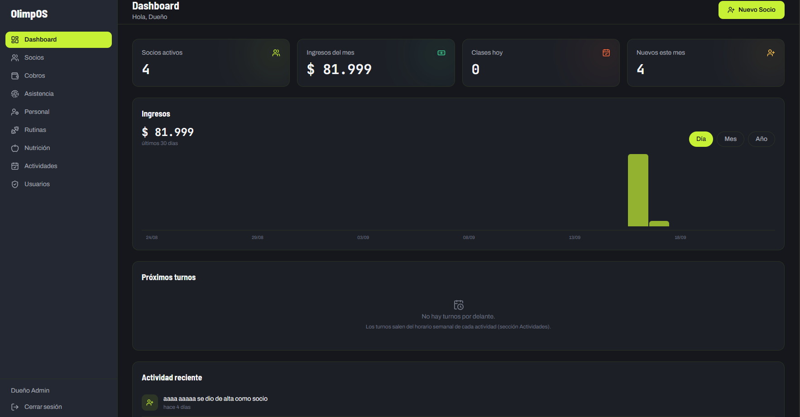
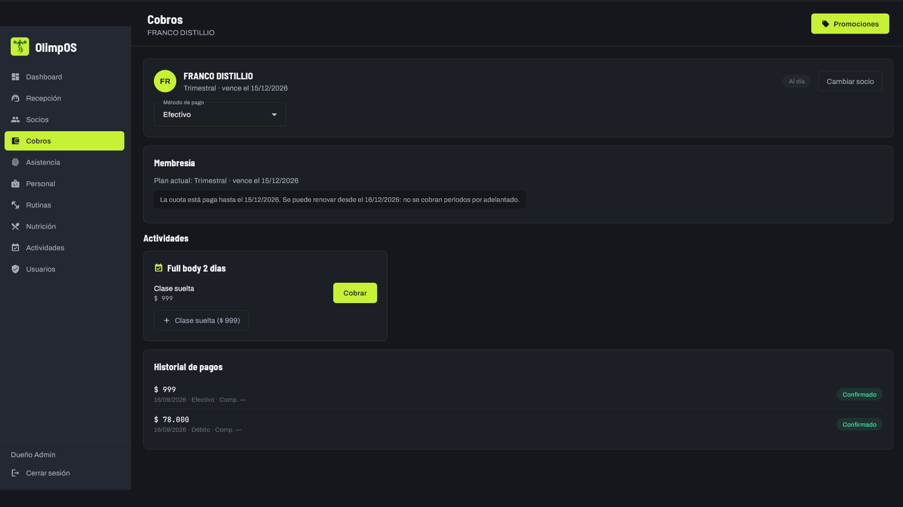
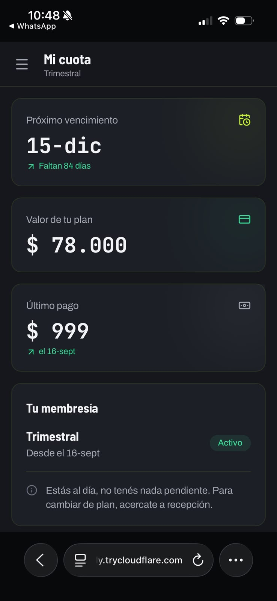
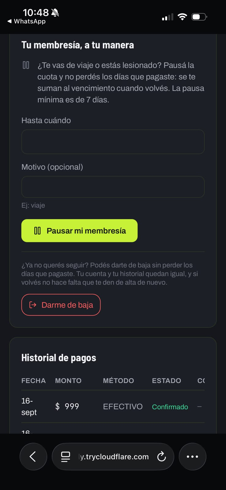

# OlimpOS

Sistema de gestión para un gimnasio: **una app web para los socios y una app de escritorio para el mostrador**, contra un solo backend y una sola base de datos.

El socio se maneja solo desde el celular —paga la cuota, reserva su clase, sigue su rutina y su dieta, mira su progreso— y el personal atiende sin fricción: cobra, ficha el ingreso, arma los horarios y ve quién se anotó a cada clase. Las dos apps se ven casi idénticas a propósito: son el mismo producto visto desde los dos lados del mostrador.

| Pieza | Carpeta | Quién la usa | Stack |
|---|---|---|---|
| **PWA** | `Proyecto - PWA/src/frontend` | Socio, entrenador, nutricionista y profesor, desde el celular o el navegador | React + TypeScript + Vite + Tailwind |
| **Escritorio** | `Flet/Proyecto` | La PC de recepción | Python + Flet |
| **Backend** | `backend/` | Las dos apps | FastAPI + SQLAlchemy sobre PostgreSQL |

---

## Capturas

**El panel del gimnasio**, en el navegador: las métricas del mes, el gráfico de ingresos por día, mes o año, y los próximos turnos.



**Cobros**, donde se le cobra la cuota, un abono o una clase suelta a un socio. El aviso del medio es una regla del negocio aplicada por el backend: la cuota está paga hasta diciembre, así que **no se puede cobrar por adelantado** y el sistema dice desde cuándo se renueva.



**El portal del socio**, que se usa en el teléfono: su cuota de un vistazo, y la autogestión de la membresía —pausarla por un viaje o una lesión, o darse de baja sin perder los días que pagó—.

<p align="center">
  
  
</p>

---

## Qué hace

**Del lado del gimnasio**
- **Socios:** alta, ficha completa, varios teléfonos y varios contactos de emergencia (con botón para llamarlos), historial médico y bajas reversibles.
- **Cobros:** membresías, abonos de actividad y clases sueltas, con promociones y comprobante. El dueño ve la facturación del mes y un gráfico por día, mes o año.
- **Asistencia:** fichaje en el mostrador, sin tope por día, con aviso si la cuota está vencida.
- **Actividades y turnos:** el horario semanal de cada clase genera los turnos solo, y la agenda muestra quién se anotó a cada uno.
- **Personal y cuentas de acceso:** altas, permisos por rol y entrega de credenciales por mail o WhatsApp.

**Del lado del socio**
- Su cuota: pagar, pausar la membresía o darse de baja sin perder los días que pagó.
- Reservar y cancelar turnos, comprar abonos y clases sueltas.
- Su rutina y su dieta, asignadas por un profesional o armadas por él mismo.
- **Contador de repeticiones con la cámara del celular:** cuenta las series con reconocimiento de pose, funciona sin internet y guarda el progreso.
- Su progreso: peso, calorías contra el objetivo de la dieta y fuerza por ejercicio.

**Seis roles** —dueño, recepcionista, entrenador, nutricionista, profesor y socio— con una matriz de permisos que el backend aplica en cada pedido, no sólo la pantalla.

Las decisiones de negocio que explican por qué el sistema se comporta como se comporta (prepago sin cobros por adelantado, bajas que respetan lo pagado, quién ve qué) están en [`CLAUDE.md`](CLAUDE.md).

---

## Instalación

### Rápida (Windows)

```powershell
git clone https://github.com/GianpeCARP/OlimpOS.git
cd OlimpOS
.\instalar.ps1
```

El script verifica qué falta, lo instala preguntando antes de cada cosa, y deja los tres proyectos listos:

1. Comprueba **Python 3.11+**, **Node 20+** y **git**, e instala con `winget` lo que falte.
2. Crea el entorno virtual del backend e instala sus dependencias.
3. Instala las de la app de escritorio y las de la PWA (`npm ci`, respetando el lock).
4. Crea `backend/.env` a partir del ejemplo, **genera la clave de sesión** y te pide la cadena de conexión a la base.
5. Verifica que el backend importe, que conecte con la base y que la PWA compile.

Se puede correr las veces que haga falta: no reinstala lo que ya está.

| Opción | Para qué |
|---|---|
| `.\instalar.ps1 -SinPreguntar` | Instala todo lo que falte sin preguntar nada |
| `.\instalar.ps1 -SoloVerificar` | No toca la máquina: sólo dice qué falta |

> Instalar Python o Node puede pedir permiso de administrador. Si los instala, cerrá la terminal y abrí otra para que aparezcan en el PATH.

### Manual

<details>
<summary>Los mismos pasos, uno por uno</summary>

**Backend** (Python 3.11+)
```bash
cd backend
python -m venv .venv
.venv/Scripts/python.exe -m pip install -r requirements.txt
copy .env.example .env      # y completar DATABASE_URL y JWT_SECRET_KEY
```

**PWA** (Node 20+)
```bash
cd "Proyecto - PWA/src/frontend"
npm ci
```

**Escritorio (Flet)** — usa el Python global, no un entorno virtual propio
```bash
cd Flet/Proyecto
python -m pip install -r requirements.txt
```
</details>

### Configuración

Todo vive en `backend/.env`, que **nunca se sube al repo**. `backend/.env.example` documenta cada variable; las que hacen falta sí o sí son dos:

| Variable | Para qué |
|---|---|
| `DATABASE_URL` | La base PostgreSQL. Funciona con [Neon](https://neon.tech) o con un Postgres local: es lo único que cambia entre uno y otro. |
| `JWT_SECRET_KEY` | Firma las sesiones. El instalador la genera; si la cambiás, se cierran todas las sesiones abiertas. |

El resto es opcional y el sistema funciona sin ellas: envío de credenciales por mail, cobro con Mercado Pago y descarga de videos de técnica.

La PWA **no necesita** su propio `.env`: por defecto habla con la API a través del proxy de desarrollo.

---

## Cómo se corre

```bash
# Backend  → http://127.0.0.1:8000  (documentación en /docs)
cd backend && .venv/Scripts/python.exe -m uvicorn main:app --host 127.0.0.1 --port 8000

# PWA      → http://localhost:5173
cd "Proyecto - PWA/src/frontend" && npm run dev

# Escritorio
cd Flet/Proyecto && python main.py
```

**El primer ingreso:** al arrancar por primera vez contra una base vacía, el backend crea la cuenta del dueño con los datos `DUENO_INICIAL_*` del `.env`. Esa cuenta nace obligada a cambiar la contraseña: entrás con la inicial, el sistema te la hace cambiar y recién ahí quedás adentro. No hay ningún usuario ni contraseña por defecto en el código.

---

## Probarlo desde el celular (Android o iPhone)

El portal del socio está hecho para usarse desde el teléfono, parado en el gimnasio, así que conviene probarlo ahí. Hace falta **HTTPS**: sin contexto seguro el navegador no da acceso a la cámara, y sin cámara no anda el contador de repeticiones.

```bash
cd "Proyecto - PWA/src/frontend"
VITE_HTTPS=1 npm run dev        # PowerShell: $env:VITE_HTTPS=1; npm run dev
```

Vite imprime dos direcciones: la local y la de la red (`https://192.168.x.x:5173`). Desde ahí hay dos caminos.

### En la misma red Wi-Fi

Abrí la dirección de red en el celular. El certificado es propio, así que el navegador va a avisar que el sitio no es de confianza: hay que aceptar y seguir.

Si no carga, casi siempre es el **firewall de Windows**, que en redes marcadas como "públicas" bloquea las conexiones entrantes. O cambiás la red a privada, o usás el túnel.

### Desde cualquier lado, con un túnel

Funciona aunque el celular esté con datos móviles, y sin tocar el firewall. Con [cloudflared](https://developers.cloudflare.com/cloudflare-one/connections/connect-networks/downloads/) instalado (`winget install Cloudflare.cloudflared`):

```bash
cloudflared tunnel --url https://192.168.0.146:5173 --no-tls-verify
```

Devuelve una dirección `https://algo-al-azar.trycloudflare.com` que se abre en el celular sin avisos de certificado, porque el certificado lo pone Cloudflare.

Dos cosas que ahorran un rato:
- **Va la IP de red, no `localhost`.** Con `VITE_HTTPS=1`, Vite atiende en la IP de la red y el túnel contra `localhost` devuelve 502.
- Si la dirección del túnel **no resuelve desde la PC**, puede ser el DNS del proveedor: desde el celular, y sobre todo con datos móviles, suele andar igual.

> **El túnel es público mientras esté abierto: cualquiera con la dirección entra al sistema.** Es para probar, no para dejar corriendo. Se cierra con Ctrl+C.

---

## Verificación

```bash
# Backend
.venv/Scripts/python.exe -c "import main"      # compila Y ejecuta los imports
.venv/Scripts/python.exe check_permisos.py     # las tres copias de la matriz de permisos coinciden
.venv/Scripts/python.exe check_db.py           # conexión y esquema

# PWA
npx tsc --noEmit -p tsconfig.app.json
npx oxlint src/

# Escritorio: construye cada pantalla con cada rol
python pruebas_vistas.py
```

Las suites de integración (`backend/pruebas/test_*.py`) corren contra la base real con el backend levantado, y necesitan la base vacía: cada una arma su propio escenario.

---

## Estructura

```
backend/          API: routers, modelos, permisos, seguridad y suites
db/               schema.sql y seed.sql: la fuente de verdad del esquema (41 tablas)
docs/             estado del proyecto, esquema en DBML y especificaciones
Flet/Proyecto/    app de escritorio
Proyecto - PWA/   app web del socio
instalar.ps1      instalador
```

## Dónde seguir leyendo

- **[`CLAUDE.md`](CLAUDE.md)** — el contexto completo: la idea, las reglas del negocio, la arquitectura y las trampas que ya costaron tiempo.
- **[`docs/ESTADO-ACTUAL.md`](docs/ESTADO-ACTUAL.md)** — en qué está el proyecto hoy y qué falta.
- **[`backend/GUIA_BACKEND.md`](backend/GUIA_BACKEND.md)** — la API por dentro.
- **`docs/olimpos_schema_actual.dbml`** — el esquema para abrir en [dbdiagram.io](https://dbdiagram.io).

---

## Autoría y licencia

Hecho por **Gianluca Pardini Enrique** — [@GianpeCARP](https://github.com/GianpeCARP).

Publicado bajo licencia [MIT](LICENSE): se puede usar, copiar y modificar libremente, manteniendo el aviso de copyright y sin ninguna garantía.
